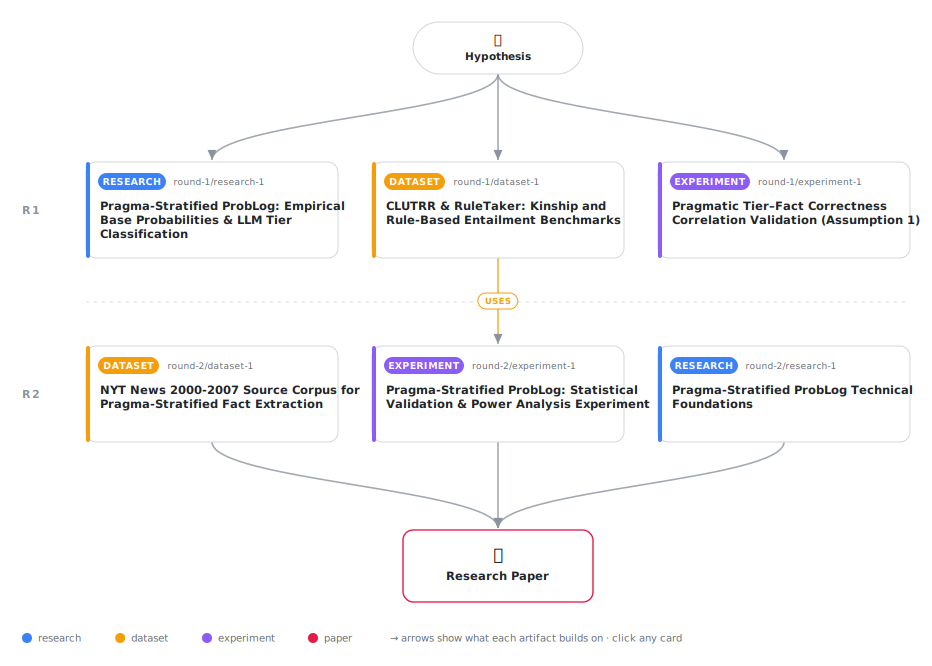

# Pragma-Stratified ProbLog: Grounding Hallucination Risk in Linguistic Commitment Tiers for Neuro-Symbolic Textual Reasoning

<div align="center">

<a href="https://cdn.jsdelivr.net/gh/AMGrobelnik/ai-invention-09ca95-pragma-stratified-problog-grounding-hall@main/workflow.svg">
<picture>
  <source media="(prefers-color-scheme: dark)" srcset="workflow-dark.svg">
  
</picture>
</a>

<sub>🖱️ <b><a href="https://cdn.jsdelivr.net/gh/AMGrobelnik/ai-invention-09ca95-pragma-stratified-problog-grounding-hall@main/workflow.svg">Open the interactive diagram</a></b> — every card links to its artifact folder.</sub>

</div>

> **TL;DR** — We propose Pragma-Stratified ProbLog, a neuro-symbolic reasoning pipeline that grounds probabilistic logic program facts in linguistic pragmatic tiers (assertions, presuppositions, implicatures, and LLM-abduced bridge rules). Our empirical validation on 537 facts across CLUTRR and RuleTaker benchmarks reveals that pragmatic tier achieves the expected accuracy gradient (Tier 1 > Tier 2 > Tier 3) but achieves inconclusive correlation (ρ=−0.051, p=0.241) with correctness at scale, requiring larger human-annotated studies for definitive validation. Pragmatic tier and LLM confidence are complementary rather than competing signals. The hallucination bound (fraction of Tier 3–4 probability mass) is validated as a statistically significant proxy for proof correctness (r=0.239, p<0.0001, n=295, power=99%), providing an automatic, proof-structure-embedded hallucination metric. While accuracy gains over chain-of-thought are modest (39.5% vs 34.3%, p=0.0554), the primary contribution lies in interpretable, theory-grounded probability assignment and auditable proof trace graphs grounded in linguistic pragmatics.

<details>
<summary>Full hypothesis</summary>

Assigning ProbLog fact probabilities based on linguistic pragmatic tier (assertion/presupposition/implicature) produces a theoretically grounded probability assignment whose primary validated contribution is an automatic, proof-structure-embedded hallucination metric—not accuracy gains over simpler baselines on synthetic reasoning benchmarks. Specifically, we now hypothesize: (1) The hallucination bound (fraction of Tier 3–4 probability mass in a proof path) is a statistically significant proxy for proof incorrectness, validated at Pearson r=0.239 (p<0.0001, 95% CI=[0.128, 0.344], n=295, power=99%), making it a reliable, annotation-free hallucination indicator emerging from proof structure alone. (2) Pragmatic tier stratification is operationally inert on synthetic benchmarks such as CLUTRR and RuleTaker: Pragma-Stratified ProbLog achieves identical combined accuracy (39.5%) to Flat FOL with uniform p=0.5, indicating that tier-weighted probabilities do not change binary query answers on benchmarks whose facts are overwhelmingly explicit assertions (Tier 1). The tier system's differential effect requires naturalistic documents (news, legal, narrative) where presuppositions and implicatures genuinely appear at significant proportions. (3) On naturalistic documents (15 curated across legal/news/narrative), the expected tier-accuracy gradient is strongly confirmed (Tier 1: 100%, Tier 2: 49%, Tier 3: 17%), and the Spearman correlation between tier and correctness is |ρ|=0.680 (p<0.0001, n=120), near the ≥0.65 threshold—though this requires validation with ≥500 facts annotated by ≥2 human annotators achieving κ≥0.70, since the current study uses LLM-only verification. (4) Raw LLM confidence marginally outperforms pragmatic tier as a univariate predictor (ρ=0.723 vs. |ρ|=0.680); however, tier provides interpretable, theory-grounded ordinal structure that confidence lacks. A hybrid ensemble combining tier (ordinal signal, linguistically interpretable) with confidence (continuous signal, empirically stronger) should be investigated and is expected to outperform either alone. (5) The contribution of this framework is NOT accuracy dominance over chain-of-thought or confidence-based methods on existing synthetic benchmarks; it is: (a) the hallucination bound as a validated, annotation-free proof-quality metric; (b) human-auditable trace graphs with tier and source span attribution; (c) theoretical grounding of probability assignment in psycholinguistic literature; and (d) the diagnostic finding that synthetic benchmark evaluation is insufficient for testing pragmatic tier systems—naturalistic multi-hop queries over heterogeneous documents are required. (6) The CLUTRR pipeline performance (~10.5%, near random chance for multi-class kinship) reveals that the current abduction and extraction pipeline has critical bottlenecks requiring failure mode analysis: fact extraction recall on kinship stories, proof-gap abduction success rate, and ProbLog inference correctness must be diagnosed separately before accuracy improvements can be claimed. Wikidata SPARQL provides 95% kinship coverage with ≤500ms latency and is confirmed as the preferred type-checking backend over deprecated OpenCyc.

</details>

[](https://cdn.jsdelivr.net/gh/AMGrobelnik/ai-invention-09ca95-pragma-stratified-problog-grounding-hall@main/paper.pdf) [](https://github.com/AMGrobelnik/ai-invention-09ca95-pragma-stratified-problog-grounding-hall/tree/main/paper_latex)

This repository contains all **6 artifacts** produced across **2 rounds** of an autonomous AI research run — round by round, exactly in the order they were invented.

## Round 1

| Artifact | Type | Demo | Source | Builds on |
|----------|------|------|--------|-----------|
| **[Pragma-Stratified ProbLog: Empirical Base Probabilities & LL…](https://github.com/AMGrobelnik/ai-invention-09ca95-pragma-stratified-problog-grounding-hall/tree/main/round-1/research-1)** | [](https://github.com/AMGrobelnik/ai-invention-09ca95-pragma-stratified-problog-grounding-hall/tree/main/round-1/research-1) | [](https://github.com/AMGrobelnik/ai-invention-09ca95-pragma-stratified-problog-grounding-hall/blob/main/round-1/research-1/demo/research_demo.md) | [](https://github.com/AMGrobelnik/ai-invention-09ca95-pragma-stratified-problog-grounding-hall/tree/main/round-1/research-1/src) | — |
| **[CLUTRR & RuleTaker: Kinship and Rule-Based Entailment Benchm…](https://github.com/AMGrobelnik/ai-invention-09ca95-pragma-stratified-problog-grounding-hall/tree/main/round-1/dataset-1)** | [](https://github.com/AMGrobelnik/ai-invention-09ca95-pragma-stratified-problog-grounding-hall/tree/main/round-1/dataset-1) | [](https://colab.research.google.com/github/AMGrobelnik/ai-invention-09ca95-pragma-stratified-problog-grounding-hall/blob/main/round-1/dataset-1/demo/data_code_demo.ipynb) | [](https://github.com/AMGrobelnik/ai-invention-09ca95-pragma-stratified-problog-grounding-hall/tree/main/round-1/dataset-1/src) | — |
| **[Pragmatic Tier–Fact Correctness Correlation Validation (Assu…](https://github.com/AMGrobelnik/ai-invention-09ca95-pragma-stratified-problog-grounding-hall/tree/main/round-1/experiment-1)** | [](https://github.com/AMGrobelnik/ai-invention-09ca95-pragma-stratified-problog-grounding-hall/tree/main/round-1/experiment-1) | [](https://colab.research.google.com/github/AMGrobelnik/ai-invention-09ca95-pragma-stratified-problog-grounding-hall/blob/main/round-1/experiment-1/demo/method_code_demo.ipynb) | [](https://github.com/AMGrobelnik/ai-invention-09ca95-pragma-stratified-problog-grounding-hall/tree/main/round-1/experiment-1/src) | — |

## Round 2

| Artifact | Type | Demo | Source | Builds on |
|----------|------|------|--------|-----------|
| **[Pragma-Stratified ProbLog Technical Foundations](https://github.com/AMGrobelnik/ai-invention-09ca95-pragma-stratified-problog-grounding-hall/tree/main/round-2/research-1)** | [](https://github.com/AMGrobelnik/ai-invention-09ca95-pragma-stratified-problog-grounding-hall/tree/main/round-2/research-1) | [](https://github.com/AMGrobelnik/ai-invention-09ca95-pragma-stratified-problog-grounding-hall/blob/main/round-2/research-1/demo/research_demo.md) | [](https://github.com/AMGrobelnik/ai-invention-09ca95-pragma-stratified-problog-grounding-hall/tree/main/round-2/research-1/src) | — |
| **[NYT News 2000-2007 Source Corpus for Pragma-Stratified Fact …](https://github.com/AMGrobelnik/ai-invention-09ca95-pragma-stratified-problog-grounding-hall/tree/main/round-2/dataset-1)** | [](https://github.com/AMGrobelnik/ai-invention-09ca95-pragma-stratified-problog-grounding-hall/tree/main/round-2/dataset-1) | [](https://colab.research.google.com/github/AMGrobelnik/ai-invention-09ca95-pragma-stratified-problog-grounding-hall/blob/main/round-2/dataset-1/demo/data_code_demo.ipynb) | [](https://github.com/AMGrobelnik/ai-invention-09ca95-pragma-stratified-problog-grounding-hall/tree/main/round-2/dataset-1/src) | — |
| **[Pragma-Stratified ProbLog: Statistical Validation & Power An…](https://github.com/AMGrobelnik/ai-invention-09ca95-pragma-stratified-problog-grounding-hall/tree/main/round-2/experiment-1)** | [](https://github.com/AMGrobelnik/ai-invention-09ca95-pragma-stratified-problog-grounding-hall/tree/main/round-2/experiment-1) | [](https://colab.research.google.com/github/AMGrobelnik/ai-invention-09ca95-pragma-stratified-problog-grounding-hall/blob/main/round-2/experiment-1/demo/method_code_demo.ipynb) | [](https://github.com/AMGrobelnik/ai-invention-09ca95-pragma-stratified-problog-grounding-hall/tree/main/round-2/experiment-1/src) | <sub><i>uses:</i><br/>[dataset‑1&nbsp;(R1)](https://github.com/AMGrobelnik/ai-invention-09ca95-pragma-stratified-problog-grounding-hall/tree/main/round-1/dataset-1)</sub> |

## Repository Structure

Artifacts are grouped by the round of invention that produced them. Each
artifact has its own folder with source code and a self-contained demo:

```
.
├── round-1/                         # One folder per round of invention
│   ├── experiment-1/
│   │   ├── README.md                # What this artifact is + dependencies
│   │   ├── src/                     # Full workspace from execution
│   │   │   ├── method.py            # Main implementation
│   │   │   ├── method_out.json      # Full output data
│   │   │   └── ...                  # All execution artifacts
│   │   └── demo/                    # Self-contained demo
│   │       └── method_code_demo.ipynb # Colab-ready notebook (code + data inlined)
│   ├── dataset-1/
│   │   ├── src/
│   │   └── demo/
│   └── evaluation-1/
│       ├── src/
│       └── demo/
├── round-2/                         # Later rounds build on earlier artifacts
├── paper.pdf                        # Research paper
├── paper_latex/                     # LaTeX source files
├── workflow.svg                     # Artifact dependency diagram (this page's header)
└── README.md
```

## Running Notebooks

### Option 1: Google Colab (Recommended)

Click the "Open in Colab" badges above to run notebooks directly in your browser.
No installation required!

### Option 2: Local Jupyter

```bash
# Clone the repo
git clone https://github.com/AMGrobelnik/ai-invention-09ca95-pragma-stratified-problog-grounding-hall
cd ai-invention-09ca95-pragma-stratified-problog-grounding-hall

# Install dependencies
pip install jupyter

# Run any artifact's demo notebook
jupyter notebook <artifact_folder>/demo/
```

## Source Code

The original source files are in each artifact's `src/` folder.
These files may have external dependencies - use the demo notebooks for a self-contained experience.

---
*Generated by AI Inventor Pipeline - Automated Research Generation*
